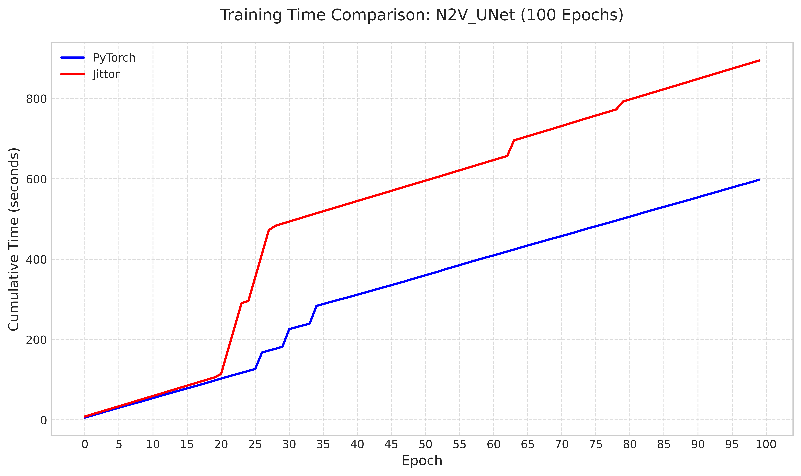
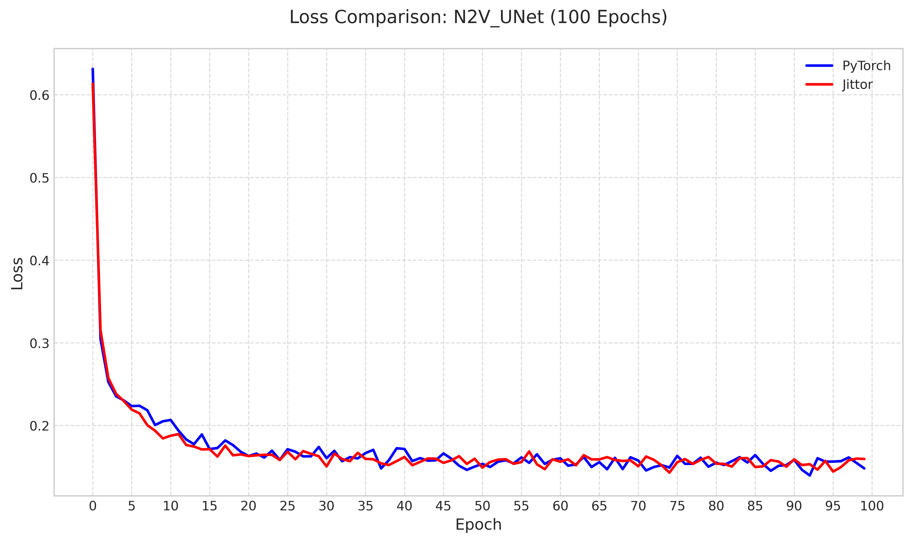
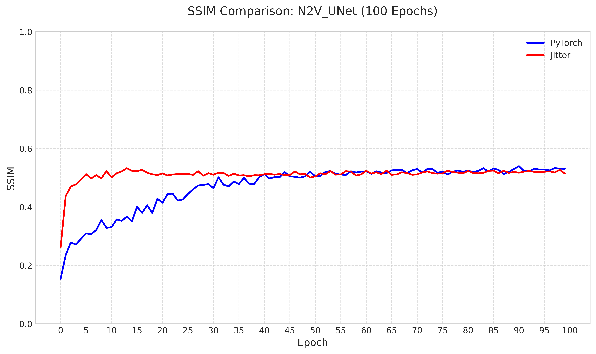

# N2V 论文复现_jittor

##  论文名称
Noise2Void - Learning Denoising From Single Noisy Images

原文链接：https://arxiv.org/abs/1811.10980


##  一、项目简介
本项目基于 Jittor 框架复现自监督图像去噪模型 N2V ，由于原论文仅提供了[TensorFlow代码](https://github.com/juglab/n2v)，这里提供了 Pytorch 代码以及转换为 Jittor 框架的代码。包括：

- 使用 BSD 数据集进行训练与测试
- 与 PyTorch 实现对齐的训练、测试流程
- 包含实验日志、性能日志、loss 曲线、PSNR 和 SSIM 等评估指标


## 二、项目结构说明
```
Jittor 项目结构                                   |  PyTorch 项目结构
-----------------------------------------        |-----------------------------------------
Noise2Void-pytorch-master/                       | Noise2Void-jittor-master/               
├─ data/                # 含噪图像、处理对比图     | ├─ data/                # 含噪图像、处理对比图
├─ datasets/            # 数据集                  | ├─ datasets/            # 数据集               
├─ weights/             # 模型权重文件和训练日志   | ├─ weights/             # 模型权重文件和训练日志
├─ dataset.py           # 数据集准备脚本          | ├─ dataset.py           # 数据集准备脚本        
├─ draw.py              # 绘图功能脚本            | ├─ draw.py              # 绘图功能脚本          
├─ model.py             # U-Net模型定义           | ├─ model.py             # U-Net模型定义         
├─ split_dataset.py     # 数据集划分脚本          | ├─ split_dataset.py     # 数据集划分脚本        
├─ test.py              # 测试脚本                | ├─ test.py              # 测试脚本              
├─ train.py             # 训练脚本                | ├─ train.py             # 训练脚本              
├─ utils.py             # 工具脚本                | ├─ utils.py             # 工具脚本              
└─ DiffusionModels/     # 扩散模型相关（若有）     | （若需要对齐可补充 DiffusionModels/ ，按左边逻辑）          


```


##  三、环境配置

### 系统环境

- 操作系统：ubuntu20.04
- PyTorch 版本：1.10.0
- Python 版本：3.8
- CUDA 驱动：11.3
- GPU：vGPU-32GB(32GB) * 1
- CPU：16 vCPU AMD EPYC 9654 96-Core Processor

---


### 安装 Jittor

```bash
# 创建 conda 虚拟环境
conda create -n new_jittor python=3.8
conda activate new_jittor

# 安装 Jittor
sudo apt install python3.8-dev libomp-dev
python3.8 -m pip install jittor

# 测试安装
python -m jittor.test.test_core
python -m jittor.test.test_example
python -m jittor.test.test_cudnn_op
```

> 参考 Jittor 官网：https://github.com/Jittor/jittor

---

### 安装依赖

```bash
pytorch
tqdm
numpy
pillow
matplotlib
opencv-python
scikit-image
scipy
pandas
```

##  四、数据准备

训练集使用 BSD400 数据集，包含 400 张灰度自然场景图像，用于模型训练。

验证集和测试集使用 BSD68 数据集，包含 68 张灰度自然场景图像，用于训练中验证模型性能及最终测试。

验证集和测试集划分（运行split_dataset.py）：按照比例划分为验证集 18 张（约 25%），测试集 50 张（约 75%）。

最终图像文件夹结构如下：
```
dataset:
└── BSD68/
└── BSD68_test/
└── BSD68_valid/
└── BSD400/
```
##  五、模型训练（train.py）

训练脚本用于训练 U-Net 模型，支持自定义噪声水平、batch size、训练轮数等参数，各参数说明如下：

| 参数              | 含义                                      |
|-------------------|-------------------------------------------|
| `--arch`          | 模型架构（固定为N2V_Unet）                |
| `--images_dir`    | 训练集路径                                |
| `--clean_valid_dir` | 验证集路径                             |
| `--outputs_dir`   | 模型权重保存路径                          |
| `--gaussian_noise_level` | 高斯噪声水平                       |
| `--patch_size`    | 训练图像块大小                            |
| `--batch_size`    | 批处理大小                                |
| `--num_epochs`    | 训练总轮数                                |
| `--lr`            | 初始学习率                                |
| `--resume`        | 从已保存的权重继续训练（可选）              |

训练命令：
```bash
python train.py --arch "N2V_Unet" \              
                --images_dir "" \
                --clean_valid_dir "" \
                --outputs_dir "" \
                --gaussian_noise_level 25 \
                --patch_size 64 \
                --batch_size 16 \
                --num_epochs 100 \
                --lr 1e-4 \      
```

训练过程说明:
- 训练时会自动在训练集图像上添加指定水平的高斯噪声，并使用 Noise2Void 策略（掩盖中心像素）进行自监督训练。
- 每轮训练后会在验证集上计算 PSNR 和 SSIM 指标，并保存当前最优模型。
- 训练日志（损失、PSNR、SSIM、时间）会保存为 CSV 文件（在wights文件夹中）。

##  六、模型测试（test.py）

测试脚本用于评估训练好的模型在测试集上的性能，并保存去噪结果和可视化对比图。参数说明如下：

| 参数                        | 含义                                      |
|-----------------------------|-------------------------------------------|
| `--weights_path`            | 训练好的模型权重路径                      |
| `--images_dir`              | 测试集路径                                |
| `--outputs_denoising_dir`   | 去噪结果保存路径                          |
| `--outputs_plt_dir`         | 可视化对比图保存路径                      |
| `--gaussian_noise_level`    | 测试时添加的噪声水平（需与训练一致）      |

测试命令：
```bash
python test.py --arch N2V_Unet \  
               --weights_path "" \
               --images_dir "" \
               --outputs_denoising_dir "" \
               --outputs_plt_dir "" \
               --gaussian_noise_level 25        
```

测试结果说明:
- 去噪后的图像保存在outputs_denoising_dir中。
- 可视化对比图（原图、带噪图、去噪图）保存在outputs_plt_dir中，包含 PSNR 和 SSIM 指标。
- 所有测试图像的 PSNR 和 SSIM 会汇总为 CSV 文件（在data文件夹中），包含单张图像指标和平均值。

##  七、对齐验证

对比 PyTorch 与 Jittor 框架在 σ = 25 下训练 100 个 epoch 的结果

### 训练耗时对比分析

两个框架总耗时差异如下图所示：




- Jittor 训练更稳定，累计耗时线性增长、无明显波动，训练过程中计算效率稳定。
- PyTorch 存在性能波动，有阶梯式耗时突增，容易受环境影响。

### loss 对比分析

训练过程两个框架 loss 对比分析如下图所示：




- 两种框架损失均快速下降并趋于稳定
- Jittor 损失略高但下降更陡峭，PyTorch 初始损失低但下降稍缓

### PSNR 和 SSIM 对比分析

验证集上两个框架 PSNR 和 SSIM 对比分析如下图所示：


      


- Jittor 收敛速度显著更快，在训练前期的梯度更新、计算效率上更具优势
- PyTorch 后期追平，说明框架影响训练效率，不影响模型上限

### 实验结果对比分析


### 可视化结果对比分析

在 σ = 25 下，以下图片顺序为：原图像，含噪图像，pytorch去噪图像，jittor去噪图像。


在 σ = 30 下，以下图片顺序为：原图像，含噪图像，pytorch去噪图像，jittor去噪图像。


在 σ = 50 下，以下图片顺序为：原图像，含噪图像，pytorch去噪图像，jittor去噪图像。


